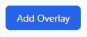
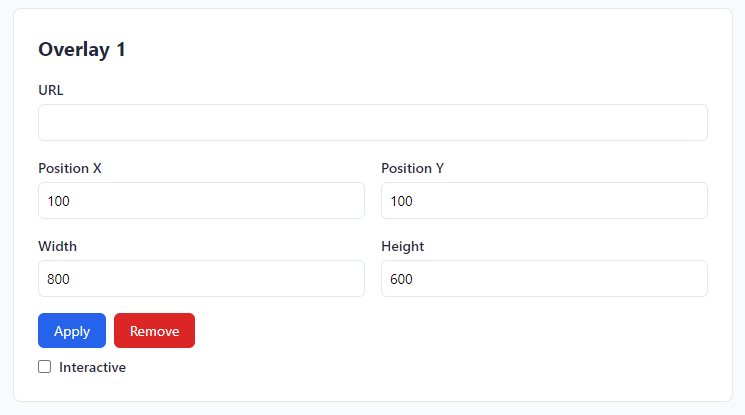
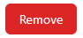
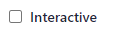
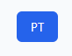
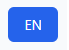
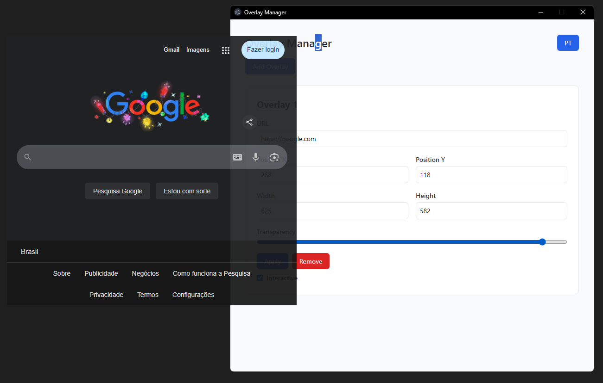
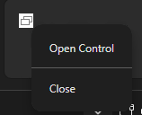

# Overlay Manager

**Overlay Manager** is a program developed with to manage overlay windows. This README provides detailed instructions on how to use the program.

Made with [Electron](https://www.electronjs.org/pt/).

### Download

- [Download the latest release here](https://github.com/HenrikSantos/overlay-manager/releases).

---

### Website

- [Website](https://henriksantos.github.io/overlay-manager/).

---

## How to use

### 1. Create Overlay

- Add a new overlay window by filling in details such as URL, position, and dimensions.



### 2. Edit Overlay

- Modify settings such as URL, width, height, and position.



### 3. Remove Overlay

- Easily delete an overlay window.



### 4. Toggle Interactivity

- Enable or disable overlay interactivity, allowing clicks, interactions and resizing.



### 5. Change Language

- Switch the interface language between English and Portuguese by clicking the button in the top-right corner.




### 6. Transparency

- You can control the transparency of the overlays using the slider.



### 7. Tray

- When you close the control, a tray is created, where you can reopen the control or actually close the app.



---

## How to install the project

### Requirements

- [Node.js](https://nodejs.org/) installed.

### Installation

1. Clone this repository:
   ```bash
   git clone https://github.com/HenrikSantos/overlay-manager.git
   ```
2. Navigate to the project folder:
   ```bash
   cd overlay-manager
   ```
3. Install the dependencies:
   ```bash
   npm install
   ```
   or
   ```bash
   yarn
   ```

### Running

1. Start the application:
   ```bash
   npm start
   ```
2. Access the control interface to manage your overlays.

---

## Contribution

Contributions are welcome! Follow these steps:

1. Create or search an issue.
2. Create a branch for the issue with the following pattern `<YourName>/issue<issueNumber>`, i recommend using the GitHub Pull Requests extension::
   ```bash
   git checkout -b HenrikSantos/issue1
   ```
3. Push your changes:
   ```bash
   git push origin my-contribution
   ```
4. Open a Pull Request and put #closes<issueNumber>.

---

**Author:** HenrikSantos
**License:** [MIT](LICENSE)

---

# Gerenciador de Overlays

O **Gerenciador de Overlays** é um programa desenvolvido com Electron para gerenciar janelas de overlay de forma intuitiva. Este README fornece instruções detalhadas sobre como usar o programa.

### Download

- [Baixe a versão mais recente](https://github.com/your-username/overlay-manager/releases).

---

### Website

- [Website](https://henriksantos.github.io/overlay-manager/).

---

## Como usar

### 1. Criar Overlay

- Adicione uma nova janela de overlay preenchendo detalhes como URL, posição e dimensões.


### 2. Editar Overlay

- Modifique configurações como URL, largura, altura e posição em tempo real.


### 3. Remover Overlay

- Exclua facilmente uma janela de overlay.


### 4. Alternar Interatividade

- Ative ou desative a interatividade do overlay, permitindo cliques, interações e redimensionamento.


### 5. Alterar Idioma

- Altere o idioma da interface entre inglês e português clicando no botão no canto superior direito.


### 6. Transparência

- É possível controlar a transparência das overlays usando o slider.


### 7. Tray

- Quando você fecha o controle, um tray é criado, nele é possível reabrir o controle ou realmente fechar o app.


---

## Como Instalar O Projeto

### Requisitos

- [Node.js](https://nodejs.org/) instalado.

### Instalação do projeto

1. Clone este repositório:
   ```bash
   git clone https://github.com/your-username/overlay-manager.git
   ```
2. Navegue até a pasta do projeto:
   ```bash
   cd overlay-manager
   ```
3. Instale as dependências:
   ```bash
   npm install
   ```

### Execução

1. Inicie o aplicativo:
   ```bash
   npm start
   ```
2. Acesse a interface de controle para gerenciar seus overlays.

---

## Contribuição

Contribuições são bem-vindas! Siga estas etapas:

1. Crie ou pesquise uma issue.
2. Crie uma ramificação para a issue com o seguinte padrão `<YourName>/issue<issueNumber>`, recomendo usar a extenssão GitHub Pull Requests:
   ```bash
   git checkout -b HenrikSantos/edição1
   ```
3. Envie suas alterações:
   ```bash
   git push origem minha-contribuição
   ```
4. Abra um Pull Request e coloque #closes<issueNumber>.

---

**Autor:** HenrikSantos
**Licença:** [MIT](LICENSE)
